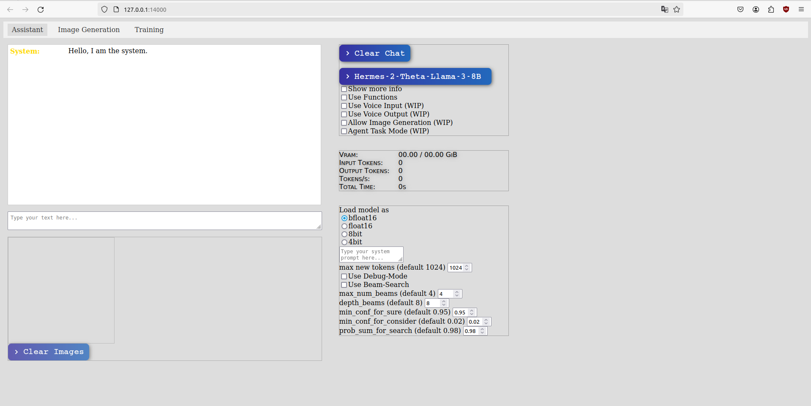

Free to use under the GNU Affero General Public License v3.0.  
A closed-source license can be obtained for commercial use. If interested, please send an inquiry to asba@tobs.cloud.

This project may use optional libraries like LlaVA-NeXT that are subject to their respective original licenses, which may be required to support certain models or functions. This project can be modified to run without these optional libraries if required.

## Asba Web Assistant

working:  
- image input support (Llama-3-Llava & phi-3-vision)  
- multiple models  
- custom adaptive beam search

WIP:
- txt2img, txt+img2img
- training support

### running it  
1. `./start_infer.sh` # this is enough if you only want the api without web ui  

2. `./start_web.sh` # for the web-ui

### more info  

**For now you will have to download the model(s) yourself and specify their path in the config file!**

note: custom adaptive beam search is slow with llama-cpp models (quantized LLama-3-70B) and Llama-3-Llava (only when using an image) right now because they have to do the beam searches in sequence, couldn't get them to work in batch. For llama-cpp it's because it (for whatever reason???) does not support batch inference. Llama-3-Llava does support it but when you supply an image additionally it gets confused (and so do I).

